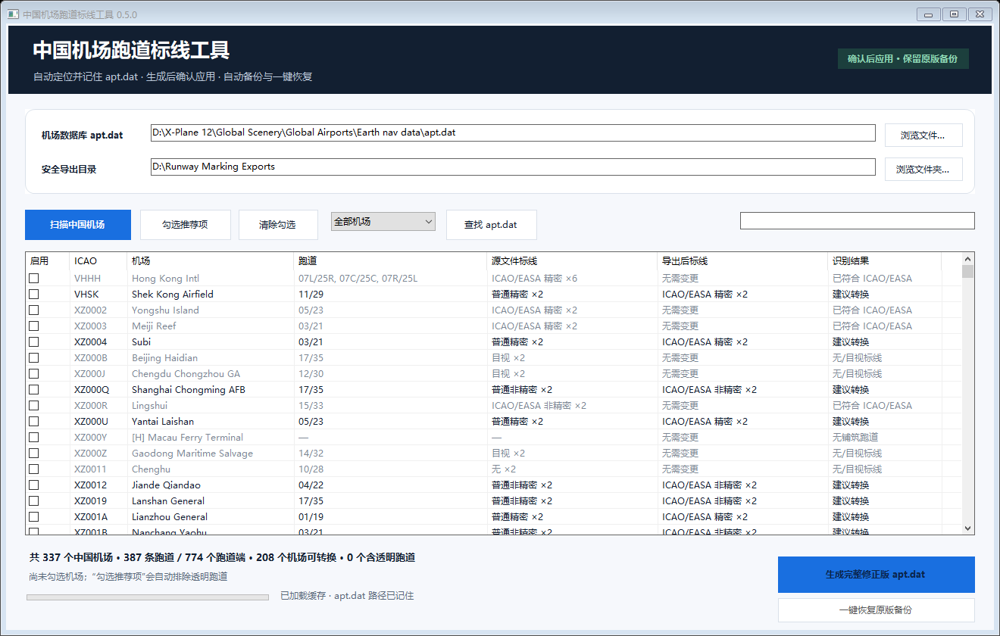
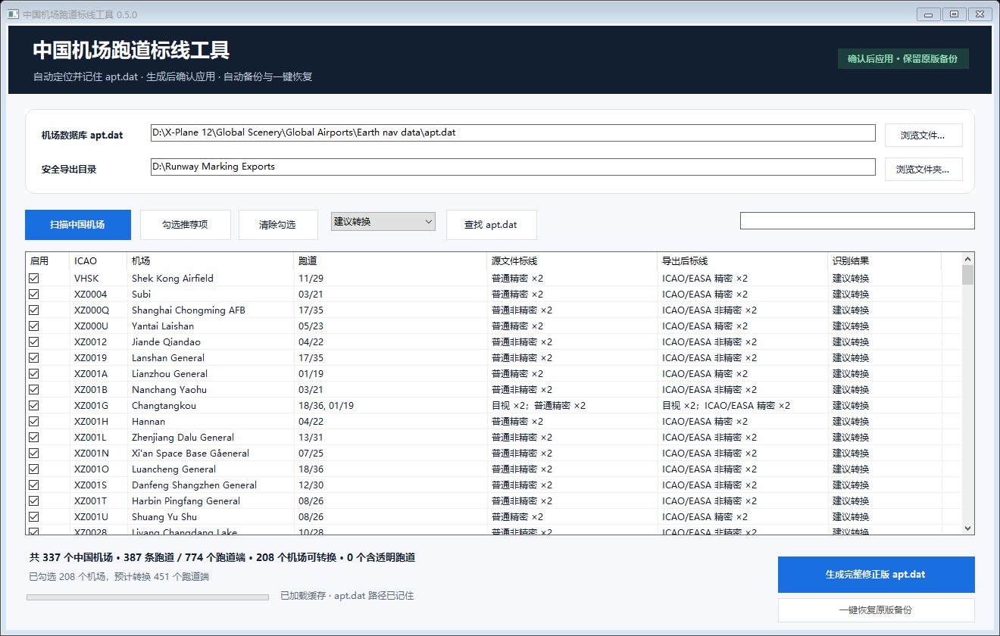

# 中国机场跑道标线工具

**自动找到 apt.dat，选择机场，确认应用；随时恢复原版备份。**

面向 X-Plane 12 Global Airports 的 Windows 桌面工具。扫描中国机场的跑道自动标线，将普通非精密 / 精密标线转换为 ICAO / EASA 对应布局，保留完整机场数据库中的其他机场、元数据和设施定义。

[下载最新版 Windows 64 位](https://github.com/Starlux531/China-Airport-Runway-Markings/releases/latest) · [使用说明](docs/USER-GUIDE.md) · [更新记录](CHANGELOG.md) · [问题反馈](https://github.com/Starlux531/China-Airport-Runway-Markings/issues)

## 0.5.0 新功能

- **直接定位 apt.dat**：优先读取上次保存的文件路径、X-Plane 安装记录、Steam 库和常见位置；必要时在本地固定磁盘的有限深度内查找。找到后自动填入完整文件路径并加载机场。
- **记住路径和机场列表**：下次启动复用有效路径与缓存；文件大小或修改时间变化后自动重扫，也可手动点击“扫描中国机场”。多套安装可选择具体 apt.dat。
- **生成后询问是否应用**：选择“是”会先校验并备份原文件，然后替换所选源 apt.dat；选择“否”仅导出完整修改副本。
- **原版备份与一键恢复**：连续应用修改仍保留首次应用前的原版，点击“一键恢复原版备份”并确认即可回退。
- **文件校验**：源文件、输出和备份均使用 SHA-256 校验；源文件发生变化、备份损坏或目标被占用时停止操作。
- **机场选择**：逐机场勾选、推荐项、搜索、筛选和排序；推荐项排除透明跑道机场。

## 界面展示

以下图片由 0.5.0 原生 WinForms 控件直接渲染，使用完整数据库加载结果和示例文件路径；机场数量随用户数据库版本变化。





## 三步使用

1. 完全退出 X-Plane，解压下载包，运行“中国机场跑道标线工具.exe”。工具自动查找并记住 `apt.dat`；若未找到，可使用“浏览文件…”手动选择一次。
2. 勾选机场或点击“勾选推荐项”，再点击“生成完整修正版 apt.dat”。
3. 在完成提示中选择“是”，自动备份并替换显示的原文件。下次启动 X-Plane 时加载修改后的标线；需要回退时点击“一键恢复原版备份”。

默认文件位置：

```text
X-Plane 12/Global Scenery/Global Airports/Earth nav data/apt.dat
```

如果选择的是独立副本，应用仅替换该副本；要让模拟器生效，请确认界面显示的是实际 X-Plane 安装目录内的文件。

## 修改范围

| 原编码 | 转换后 | 含义 |
| --- | --- | --- |
| 2 | 6 | 普通非精密 → ICAO / EASA 非精密 |
| 3 | 7 | 普通精密 → ICAO / EASA 精密 |
| 0 / 1 / 4 / 5 / 6 / 7 | 不变 | 保留现有标线 |

工具只转换所选机场的目标跑道记录，不修改 `scenery_packs.ini`，不生成覆盖默认机场的独立地景包。第三方机场的自定义贴图不在修改范围内；实际可见效果取决于当前启用的机场地景。

## 运行与备份

- Windows 10 / 11，64 位；下载包自带 .NET 运行环境，无需另行安装。
- 备份保存在所选 `apt.dat` 同目录的 `.ChinaRunwayMarkingsBackups` 文件夹中，请保留整个文件夹。
- Steam 验证或 X-Plane 更新可能替换数据库。请重新扫描并生成修正版；工具会拒绝将不匹配的旧备份覆盖到新数据上。
- 配置与机场缓存仅保存在本机 `%LOCALAPPDATA%/ChinaRunwayMarkings`；程序不上传机场数据库或安装路径。
- 需要足够空间存放完整导出、备份和临时替换文件，建议至少预留源 `apt.dat` 大小的 4 倍可用空间。导出盘与游戏盘分别需要可用空间。

## 闭源发布

本工具以闭源二进制形式发布，程序源代码不公开。本公开仓库仅提供介绍、展示图、使用说明和下载入口。GitHub 自动提供的 “Source code” 压缩包仅包含这些公开材料，不是可运行程序；请下载 Release 中的 `China-Airport-Runway-Markings-0.5.0-win-x64.zip`。

Copyright © 2026 Starlux531. All rights reserved. 许可见 [LICENSE.txt](LICENSE.txt)。随附 .NET 组件使用各自的第三方许可证。

本项目为第三方辅助工具，与 Laminar Research 无隶属关系。当前验证覆盖文件转换、备份恢复和界面操作，尚未完成模拟器内视觉效果的全面验证。
